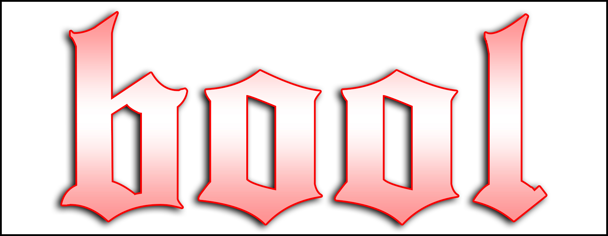

## Introduction

## Features
- a
- b
- c

### Code Examples
````
// Variable Declarations

foo = 101                                       var foo = 101;
string:bar = 101                                var bar = "101";
````
````
fun foo (bar):                                 var foo = function(bar) {
  result = 0                                     var result = 0;
  for i in bar:                                  for (var i = 0; i < bar; i += 1) {
    if i < 5:                                      if (i < 5) {
      result = "foobar"                               result = "foobar";
    elif i > 7:                                    } else if (i > 7) {
      result = "barfoo"                               result = "barfoo";
  ret result                                       }
                                                 }
                                                 return result;
                                               };
````
````
fun gcd (a b):                                  var gcd = function(a, b) {
    if !b:                                          if (!b) {
      ret a                                           return a;
    ret gcd(b, a % b)                               }
                                                    return gcd(b, a % b);
                                                };
````
